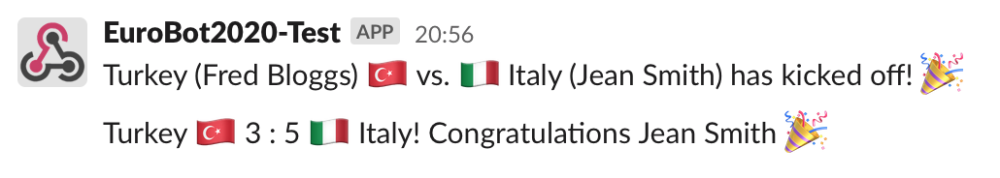

# Euro Slack Bot

Slack Bot to announce football events and tag the relevant team "owners"!

This bot is useful for keeping people involved in Euros sweepstakes, each country is given a slack username or simply a name. Slack tags are detected by checking for all lowercase names.

This bot then posts to slack at the start or end of a match, tagging the relevant people involved in the match as well as the result of that match.

### Example messages



## Usage

Copy the .env.example to .env and input the relevant values for your use case. 

You'll need to generate an api token at football-data.org, and an incoming webhook for your Slack workspace/channel.

### Native

Run by executing `src/App.php`.

### Docker

```
docker run -d --rm \
    --name <name> \
    -v <path_to>/.env:/app/.env \
    davidpugh/euro-bot:latest
```
